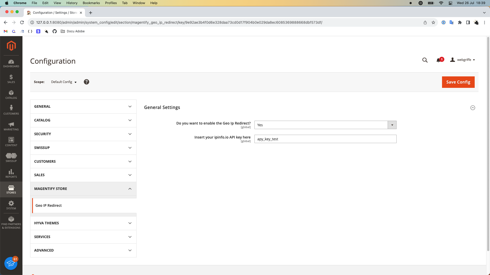

# Geo Ip Redirect Module Documentation

This is the documentation of the Geo Ip Redirect module for Magento 2 which perform redirection to the correct user store view.

The plugin performs the redirect only when the user visits the homepage of your e-commerce without the locale code in the URL. For example, if the user navigates to [https://example.com](https://example.com/), the redirect will be triggered. However, if the user visits [https://example.com/en](https://example.com/en), the redirect will not be executed.

## Installation

Once you downloaded the module’s ZIP file from the email received after the payment, follow these steps:

1. Create an `artifacts` folder inside your Magento’s root folder.
```
mkdir artifacts
```   

2. Deny public access to this folder by properly configuring your web server. You have to do this if the document root is not the `pub` folder. See [Magento documentations](https://experienceleague.adobe.com/docs/commerce-operations/installation-guide/tutorials/docroot.html).
```
// only if you use Apache and pub is not configured ad the document root folder
echo "Deny from all" > artifacts/.htaccess
```

3. Copy the module’s ZIP file inside the `artifacts` folder. Do not extract the contents of the file, just move the whole archive there.

4. Add the `artifacts` folder as Composer repository
```
composer config repositories.artifacts artifact artifacts/
```

5. Install the module
```
composer require webgriffe/module-quipago
```
N.B. If you receive an error saying that the module can’t be found, open your `composer.json` file, locate the repositories section and edit the file to make sure that `artifacts` is the first item in that section. Save the file and try again with the `composer require` command.

6. Launch the Magento’s setup upgrade script
```
php bin/magento setup:upgrade
```

7. Flush the cache:
```
php bin/magento cache:clean
```

8. Recompile the dependency injection data:
```
php bin/magento setup:di:compile
```

## Configuration

General configuration is located in **Stores -> Configuration -> Magentify Store -> Geo Ip Redirect -> General**. Here are the following settings available:

- **Do you want to enable the Geo Ip Redirect?**: allows you to enable or not the redirection.

- **Insert your ipinfo.io API key here**: To perform the redirection the module use a service named [ipinfo.io](https://ipinfo.io/). Create a [free account](https://ipinfo.io/signup) and insert your token here. You have up to 50k request a month, if you need more you can subscribe to a [different plan](https://ipinfo.io/pricing). 



**N.B.** The module works only if you configured your store to include the store code in URLs. To do so, follow the [official documentation](https://experienceleague.adobe.com/docs/commerce-admin/stores-sales/site-store/store-urls.html#include-the-store-code-in-urls). 

The module redirect the user based on 2 info:

- The country where the user is, taken from the IP. The module search along the **Allow Countries** config and detect the first website with the country's user. To manage this config for each of your websites go to **Stores -> Configuration -> General -> General -> Country Options -> Allow Countries**. 

- The languages configured by the user on his browser. The module search along the languages configured for each store view of the previous selected website and redirect to the first store view founded with the user language.

---

© Copyright 2023, Magentify Store.